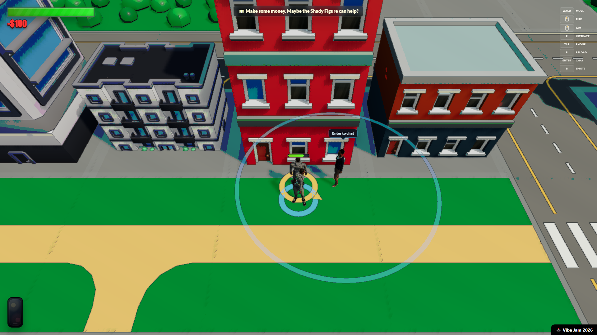

# Vibe Theft Auto



Vibe Theft Auto is a browser-based multiplayer city game built with Three.js,
Colyseus, and a small Node.js backend. The frontend is deployed as static assets
on Vercel, while the realtime game server runs on Colyseus Cloud.

Built by [oldfeet](https://x.com/oldfeet).

## Play

Production: [www.vibetheftauto.xyz](https://www.vibetheftauto.xyz/)

## Stack

- Three.js browser client bundled with esbuild.
- Colyseus realtime multiplayer backend.
- PostgreSQL-backed world persistence in production.
- Vercel for frontend hosting.
- Colyseus Cloud for backend hosting.

## Local Development

Install dependencies:

```sh
npm ci
```

Copy the example environment file and fill in local values:

```sh
cp .env.example .env
```

Run the frontend and backend together:

```sh
npm run dev
```

The local frontend defaults to port `4173`, and the local Colyseus server
defaults to port `2567`.

## Useful Scripts

```sh
npm run build:web      # build the Vercel frontend bundle
npm run build          # run backend syntax checks for Colyseus Cloud
npm run build:all      # build frontend and check backend
npm run validate       # validate world editor data
npm run deploy:colyseus
```

## Configuration

Runtime secrets are intentionally not committed. Start from `.env.example`.

Important production values include:

- `DATABASE_URL`: PostgreSQL connection string for world persistence.
- `PLAYER_SNAPSHOT_TTL_MS`: optional time window for restoring players after
  backend restarts; defaults to 30 minutes.
- `VTA_SERVER_URL`: frontend build-time websocket URL for the Colyseus
  backend, such as `wss://us-atl-06d422c8.vibetheftauto.xyz`.
- `COLYSEUS_PUBLIC_ADDRESS`: optional hosted backend address override.
- `OPENAI_API_KEY`: optional key for AI NPC replies.
- `ADMIN_KEYS`: optional comma-separated keys for privileged admin tools.

## Deployment

The frontend and backend are deployed separately:

- Vercel builds the frontend with `npm run build:web` and serves `dist/`.
- Colyseus Cloud runs the backend with `npm run build` as a backend-only check.

See [docs/vercel-frontend-deployment.md](docs/vercel-frontend-deployment.md)
and [docs/colyseus-cloud-deployment.md](docs/colyseus-cloud-deployment.md) for
the production setup notes.

## Asset Pipeline

Commit runtime-ready assets and keep bulky source exports local. See
[docs/asset-pipeline.md](docs/asset-pipeline.md) for the Mixamo optimization,
animation extraction, and third-party asset import workflow.

## Assets And License

Source code is licensed under the ISC License. Bundled game assets, third-party
assets, and vendored code remain under their own terms and are not relicensed as
ISC. Mixamo-derived runtime assets are included only so the game runs as
intended and are not reusable as standalone assets. See
[ASSET_POLICY.md](ASSET_POLICY.md) and
[assets/mixamo/NOTICE.md](assets/mixamo/NOTICE.md) for details.

## Open Source Release

This repository is intended to be publishable directly after running the release
checklist in [docs/open-source-release.md](docs/open-source-release.md). The
`public:export` script remains available if you ever want to create a separate
tree-only copy without Git history.
